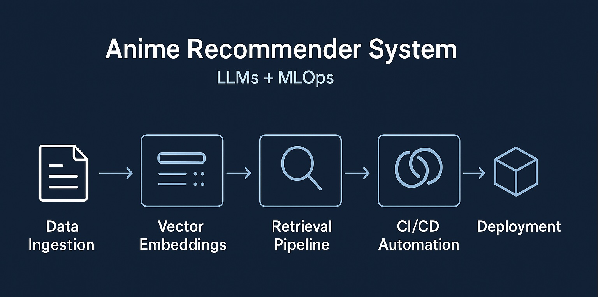
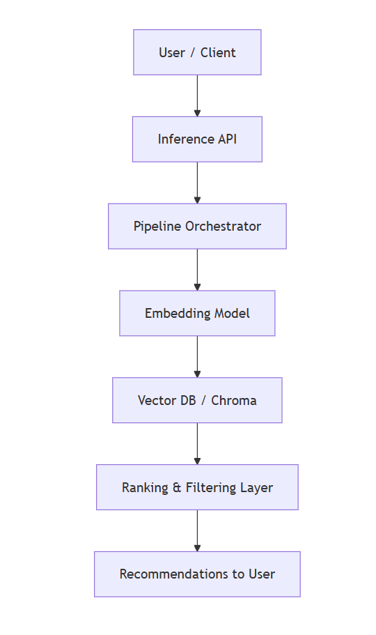
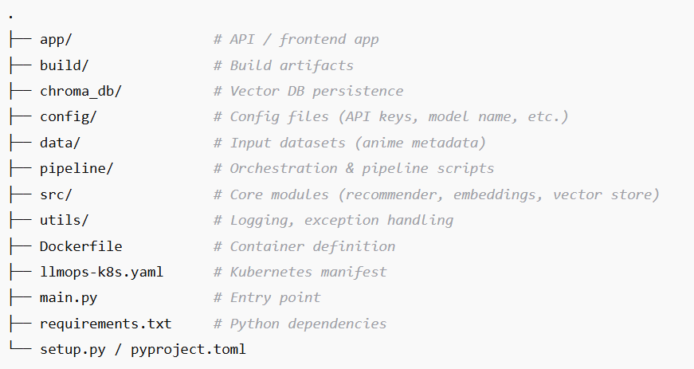

# 🎌 ANIME RECOMMENDER SYSTEM with LLM + MLOps

> A scalable, modular anime recommendation system powered by Large Language Models (LLMs) and MLOps — combining semantic embeddings, vector search, pipelines, and cloud-native deployment.

---

## 🎯 Overview

**ANIME-RECOMMENDER-SYSTEM-LLMOPS** is a recommendation engine that uses **LLMs for text embeddings** and a **vector database** to deliver highly relevant anime suggestions.  

It is designed with **MLOps best practices** in mind: modular pipelines, containerized deployments, observability, and cloud scalability.

**Example Use Case:**
> “Recommend anime similar to *Death Note* but with more fantasy elements.”

---

## 🏗 Architecture & System Design

### High-Level Flow

## ✨ Key Features

✅ LLM-based query understanding (semantic embeddings)

✅ Vector similarity search for efficient recommendations

✅ Modular pipeline (ingestion → embeddings → retrieval → ranking)

✅ MLOps ready (containerized, deployable on Kubernetes)

✅ Scalable and extensible design for new models and datasets

✅ Logging & monitoring hooks for production observability

## 🔧 Tools & Frameworks

| Component                | Tool / Library                                      |
| ------------------------ | --------------------------------------------------- |
| **Embeddings / LLM**     | HuggingFace, OpenAI                                 |
| **Vector DB**            | [Chroma](https://www.trychroma.com/)                |
| **Serving API**          | FastAPI / Streamlit                                 |
| **Pipeline / Workflow**  | Custom orchestration, extendable to Airflow/Prefect |
| **Deployment**           | Docker + Kubernetes (llmops-k8s.yaml)               |
| **Logging & Monitoring** | Python logging, Prometheus (optional)               |
| **Data Processing**      | pandas, numpy                                       |
| **Config Management**    | YAML, `.env`                                        |

## 📂 Folder Structure

## 📈 Scaling & Monitoring

- 🌀 Batch embedding updates for new anime metadata
- 🗃 Index sharding for large datasets
- 🚀 K8s autoscaling based on CPU/memory/load
- 📊 Metrics collection (latency, request count, retrieval stats)
- 🛠 Logging & tracing via Python logger + Grafana Cloud

## ⚡ Setup & Installation

#### Prerequisites

- Python 3.10+ (or as required)
- Docker
- Kubernetes cluster (if deploying)
- Access to desired embedding / LLM API keys
- Sufficient compute & memory (for embedding, vector ops)

#### 1. Clone Repository

> `git clone https://github.com/anulsasidharan/ANIME-RECOMMENDER-SYSTEM-LLMOPS.git`

> `cd ANIME-RECOMMENDER-SYSTEM-LLMOPS`

#### 2. Setup Environment

> `uv init`

> `uv venv`

> `.venv\Scripts\activate`

> `uv add -r requirements.txt`

#### 3. Run Locally

> `streamlit run .\app\app.py`

#### 4. via Locally

> `docker build -t anime-recommender .`

> `docker run -p 8000:8000 anime-recommender`

#### 5. Deploy on Kubernetes

> `kubectl apply -f llmops-k8s.yaml`

## 🏁 Conclusion

The ANIME-RECOMMENDER-SYSTEM-LLMOPS demonstrates how LLMs, vector search, and MLOps practices can be combined to build a scalable and production-ready recommendation engine.

While this project focuses on anime recommendations, the architecture is generalizable to any domain where semantic understanding and personalization are crucial — from e-commerce to content discovery and learning platforms.

This system highlights the value of:

🔹 LLMs for semantic embeddings

🔹 Vector databases for similarity search

🔹 MLOps for scalability, reproducibility, and reliability

🚀 The journey doesn’t end here — future work can explore personalization, multimodal embeddings, hybrid recommenders, and feedback loops to make the system even more powerful and user-centric.